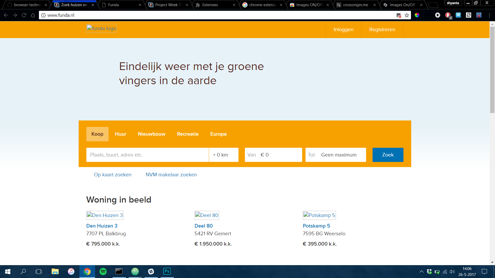
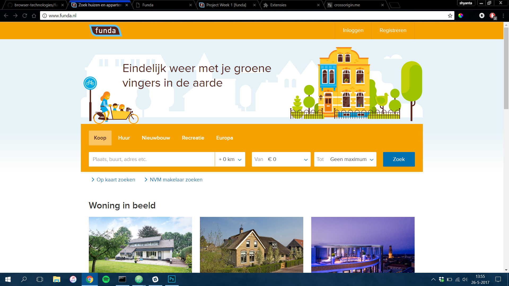
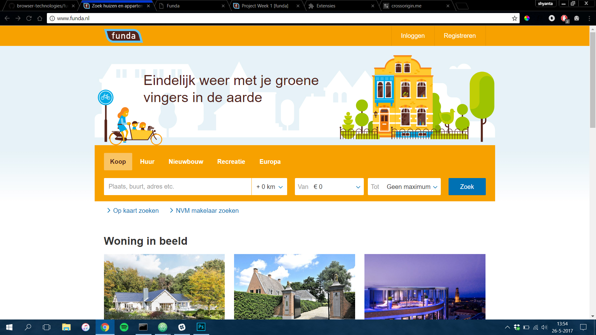
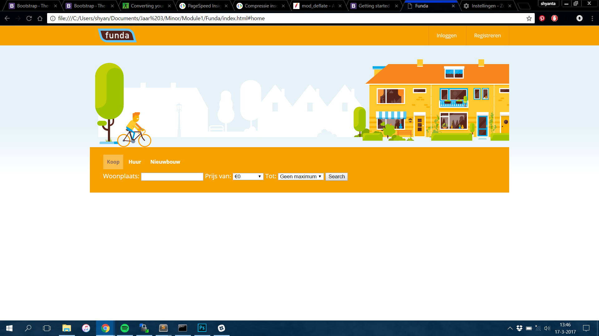
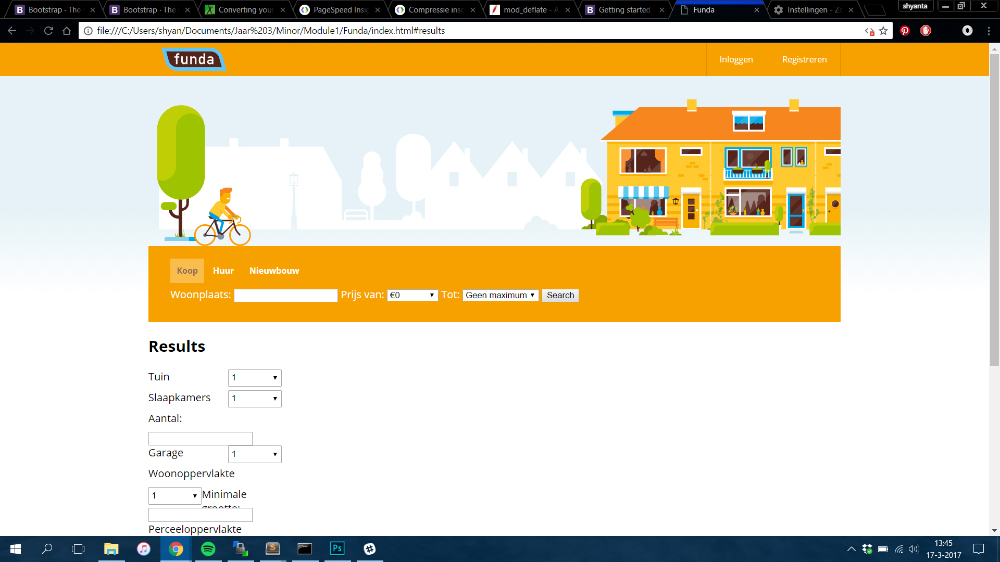
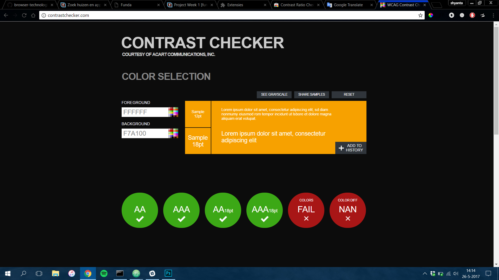
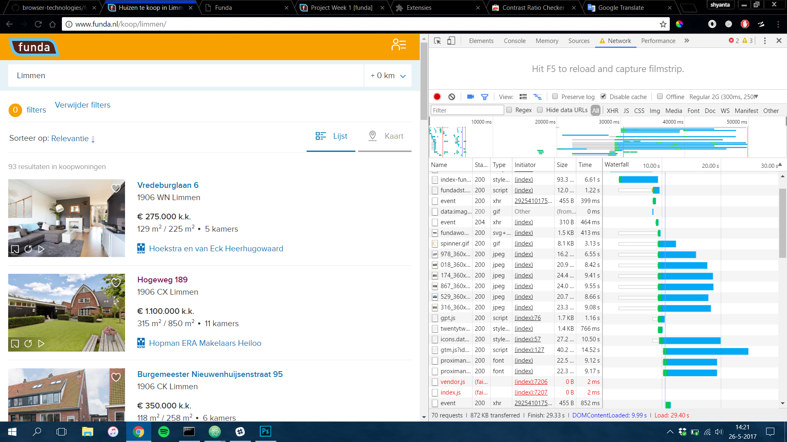
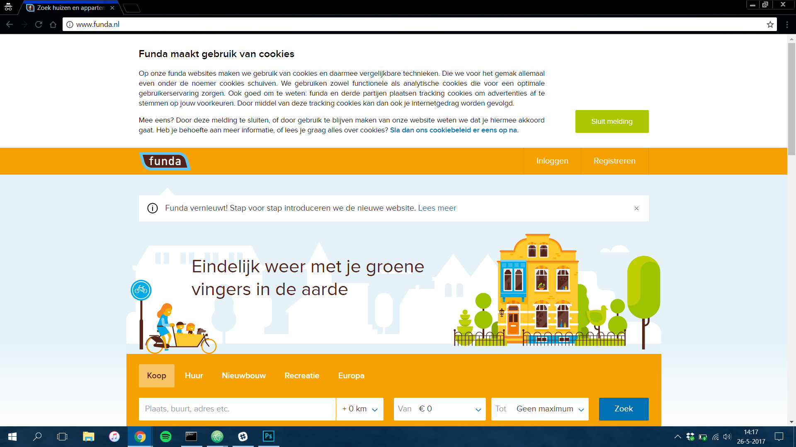
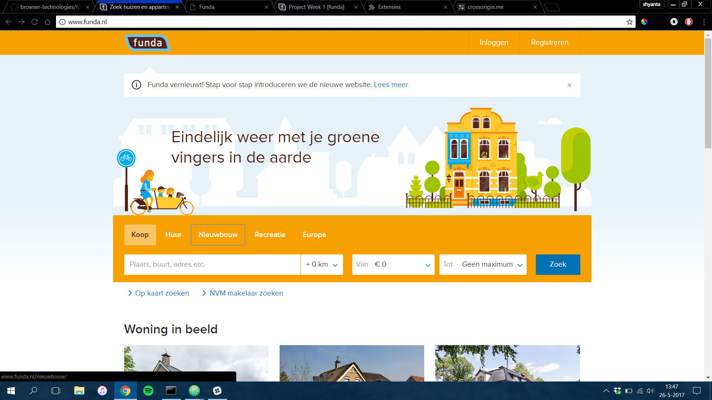

# minor-BrowserTechnologies

## Breek het web
[Presentatie](/Breek%20het%20Web/Custom%20Fonts.pdf)

# Fork your Funda

## The 8* commandments of Progressive Enhancement

### You shall not depend on pictures
Pictures are fun on your website, but don't forget that pictures usually have a big file size, meaning
your page will be very slow. Because of this, lots of people will choose to filter out the pictures, mostly
when they're in a place where there is no good internet connection. So when the pictures give all the important
information from the site, you're doing something wrong. Pictures are meant to support the information,
that should be given in text format.  
**Ways to solve this**
-	Always give your `` a `tiltle=""` and `alt=""` tag. When the picture isn't loaded, people can still read what the picture is about
-	Replace the `` tag with `<picture>` to render different pictures on different websizes
-	Compress your pictures and use `webp` as format. But write fallbacks for this, not every browser knows how to render `webp`.

**How does this work on the [funda](www.funda.nl) site:**

As you can see they used the img elements in a good way, despite that the images are gone,
people can still see what kind of image there was supposed to be.

### You shall use fallbacks for custom fonts
The danger with custom fonts without fallbacks is that not every browser knows how to render
your font. Also it has to be loaded so the first seconds people might see the basic browser
font. When your custom font is sans-serif and the browser font is serif. The difference will
be big and this isn't a nice step for your users.
Always write a backup font like even `sans-serif` or `serif`. This way if the font isn't
loaded, users will still see a font that looks like the one you have originally.

Also icon fonts are very dangerous. They can be rendered in different ways and most ad-blockers
block icon fonts. This will make sure that those people will see empte squares instead of a
icon. Without any feedback, a lot of buttons will lose their meaning.
So use svg's to render icons, or at least use them in combination with text so a button
won't become useless.

**How does this work on the [funda](www.funda.nl) site:**  
With custom fonts:

Without custom fonts:

As you can see there is a fallback font that will remain the original styling from the Funda site.

### You're website shall work without JavaScript
Make sure your site will also be rendered without javascript. Javascript is very sensitive,
when a browser doesn't understand something, it will stop running and crash. The following code won't be executed.
Also javascript can be turned off, and you don't want people to miss out on information because of this.
So when you're hiding stuff so you can turn them on with javascript again. Be sure to hide
them with javascript to. When javascript isn't working. At least al your information will be
visible.

Also be sure to write enough checks where you can be sure code will work for every browser.
When you're working with a form, maybe use serversided javascript. This works even without normal javascript. So even the oldest browsers will still render forms, when the al rendered
serversided.

**How does this work on myFunda site:**

With JavaScript:

Without JavaScript:

On the last photo you can see that the results section is shown when javascript doens't work.
So when javascript is turned of or something all the sections are still visible.

### You shall use the right contrast with color
When the contrast on your site isn't right. People who are color blind, or partially colorblind, won't be able to read your site. Text can fade away or some active states won't
be visible. Always use the right contrast so every user can still see your site and important
items.

Always test this with a contrast checker. Or even better, go out User Testing. The best way
to test if something works is to test with the target audience. This way you can see on what
points they are struggling.

**How does this work on the [funda](www.funda.nl) site:**

As you can see the contrast on the Funda site is used correctly

### You shall take into account that broadband internet is rare
You have to take into account that not all country's have fast internet. Or people their data
is running out. This means that the loading of the site can take very long. Put in a budget
to make the performance much better on the website. 
To get more insight on how this works, your Devtools to check on what parts you're losing performance.

**How does this work on funda's orignal site:**

On a regular 2G network the DOMcontent is loaded in 10 seconds.
The page is loaded in 29 seconds. Because of their performance the DOMcontent is loaded faster. This means people can see the texts but the images are loaded afterwards. This is a good thing.

### You shall not depend on cookies
There are still to many people who turn off the usage of cookies. If your site depends on cookies, this isn't a good thing. Of course you can use cookies as an enchancement. But
if people turn off the cookies you're site won't work when cookies are the main thing on your
site.

**What funda does with the cookies:**

Funda only uses cookies for tracking, so your ads on pages will be related to what you've searched for on funda. This can become handy, but isn't necessary. So this won't cause any problems.

### You shall not depend on localStorage
LocalStorage is a great way of saving data for the next time a user enters your site. But
what people forget is that localStorage doesn't work in all browsers. Especially in private
browsers. So if your site works with localStorage and users are surfing in private mode,
they won't be able to use your site.

Also use localStorage as an enhancement. If you can use is, use it wisely but if not, make sure
the users still have a great experience.

**How does this work on my funda:**

My site works with localStorage to fetch the data. So even when a user searches, they won't
get any data returned.

### You're website shall work without usage of a Mouse/Trackpad
Make sure the whole website has focus styles to make it useable for users without a mouse or trackpad. Also for the blind people with screenreaders you have to be sure that the tabflow is right. With a good tabflow the site is easy to search without having to see the screen.
Make obvious focus styles for the people who can see, so they know where they are on the page.

**How does this work on [funda](www.funda.nl):**

