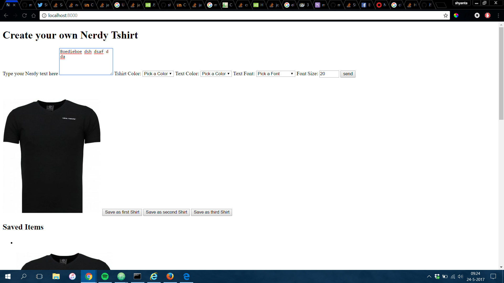
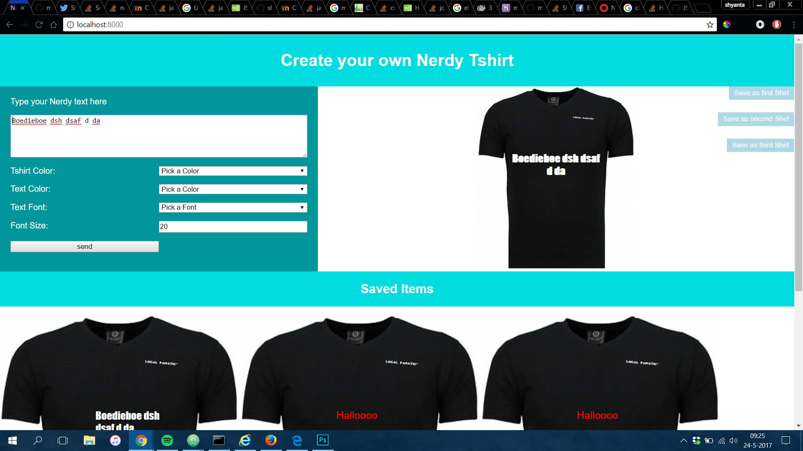

# minor-BrowserTechnologies

## Case:
I want to save my favorite T-shirts-with-nerdy-texts, and want to use them the next time I visit.
### What did I build
With this site, you can create your own nerdy T-shirt. You can pick the color of shirt you'd like.
Type the text that you want printed on your T-shirt, and what color and font you want the text
to be.
If your browser gives you the ability to use LocalStorage, you can save your 3 best T-shirts.
You can keep selecting new shirts as on of the top 3. It will simply overwrite them.
The next time you visit the site, the browser will have remembered what three T-shirts you've
saved.

## Browser supports
This project is build Progressive enhanced. So the older browsers may see some different things
then the newer ones. Like the save button. I've tested the app on the following browsers:

### Tested Devices / browsers
Devices | Browser/OS
--- | ---
Dell XPS 13 | Chrome
Dell XPS 13 | Firefox
Dell XPS 13 | IE5 +
Dell XPS 13 | Edge
DeviceLab | Apple iPod
DeviceLab | Apple iPad
DeviceLab | Microsoft Surface
DeviceLab | Google Nexus
DeviceLab | Kindle
DeviceLab | Nokia Windows Phone
Iphone 6S | Safari / iOS 10.3

## Features
-	Custom made T-shirt text
-	Choice in T-shirt color
-	Choice in text styling
-	Saving T-shirts for later

## Support
###	HTML
HTML is supported in all the browsers. The minor changes I made are:
-	`<section>` to `<div>`
-	`<header>` to `<div role="header">`
-	`<footer>` to `<div role="footer">`
###	CSS
The CSS is styled with flexbox. Because flexbox isn't supported everywhere, I used
`@supports(display: flex){}` to make a more flexible design.
When flexbos isn't supported, the page is styled with `floats`.
With flexbox
```CSS
@supports(display:flex){
	body {
		display: flex;
		flex-direction: row;
		flex-wrap: wrap;
	}
		#header {
			flex-basis: 100%;
			width: 100%;
			float: none;
		}
		form {
			align-items: flex-start;
			color: white;
			flex-basis: 40%;
			width: 40%;
			display: flex;
			flex-direction: row;
			flex-wrap: wrap;
			float: none;
		}
			form textarea {
				align-self: flex-start;
				flex-basis: 100%;
				float: none;
			}
			form label {
				align-self: flex-start;
				flex-basis: 50%;
				width: 50%;
				float: none;
			}
				form label[for="nerdy"]{
					align-self: flex-start;
					flex-basis: 100%;
					width: 100%;
					float: none;
				}
			form select, form input {
				align-self: flex-start;
				flex-basis: 50%;
				width: 50%;
				float: none;
			}
		#make-shirt {
			float: none;
			flex-basis: 60%;
			width: 60%;
			text-align: center;
			position: relative;
		}
		#saved-items {
			float: none;
			flex-basis: 100%;
			width: 100%;
		}
		#footer[role="footer"] {
			float: none;
			flex-basis: 100%;
			width: 100%;
		}
		@media screen and (max-width: 40em){
			form {
				flex-basis: 100%;
				width: 100%;
			}
			#make-shirt {
				flex-basis: 100%;
				width: 100%;
			}
		}
}
```
### Javascript
The thing that JavaScript doesn't support everywhere is localStorage.
I'm using a check if localStorage exists. If it does support, the attribute hidden
is removed from the buttons and savedItems section. So if localStorage is supported,
the buttons that activate the localStorage are shown. When your browser doesn't support
localStorage, these buttons will stay hidden, and the option to save in localStorage is not
shown.

The check for localStorage works like this:
``` JS
if (typeof window.localStorage !== "undefined"){
	console.log('YES');
} else {
	console.log('NO');
}
```

## Screenshots
### Without CSS

### With CSS


## Install Project
First clone the files to your computer.
`git clone https://github.com/shyanta/minor-BrowserTechnologies.git`

Install dependecies
`npm install`

Run the code local
`npm start`

## Sources
-	[CanIuse](http://caniuse.com/)
-	[StackOverflow](https://stackoverflow.com/)
